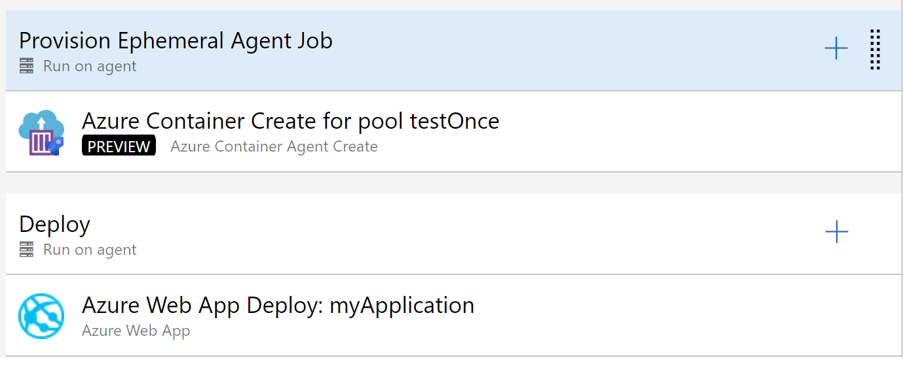

# Ephemeral Pipelines Agents

Provisions an ephemeral Azure container with an Azure Pipelines agent for deployment purposes.

When you want to deploy to Azure Resources that are exposed on the internet and only accessible via a [private network](https://docs.microsoft.com/en-us/azure/virtual-network/virtual-networks-overview) you are excluded from using [Microsoft-hosted agents](https://docs.microsoft.com/en-us/azure/devops/pipelines/agents/hosted?view=azure-devops) and you need to maintain your pool of [self-hosted agents](https://docs.microsoft.com/en-us/azure/devops/pipelines/agents/agents?view=azure-devops#install).

The purpose of this technique is to eliminate the need to maintain self-hosted agents (for **deployment** purposes) and still be capable of deploying to private azure resources. This is achieved by running ephemeral pipeline agents in an Azure Container (no public IP address)

The purpose of this task is to create a short-lived Azure Pipelines Agent to run a deploy in a private virtual network so you can deploy assets to Azure Resources that are not internet accessible.

This task provisions an agent in an [Azure Container Instance](https://azure.microsoft.com/en-us/services/container-instances/) and the agent can be used once and then it self destructs.

This way, you can deploy to private Azure resources without having to expose them on the internet or having to maintain self-hosted agents on the same (or with access) virtual network.



## Parameters

These are the task parameters.

* **Azure subscription** Azure resource manager subscription to provision the container. It will at least require contributor permission on the resource group and read permission on the vnet resource group
* **Resource group** The resource group where the agent container will be provisioned.
* **Location** The location where the container will be provisioned
* **Azure DevOps Token** The [personal access](https://docs.microsoft.com/en-us/azure/devops/organizations/accounts/use-personal-access-tokens-to-authenticate?view=azure-devops) or OAuth token used to register/unregister the agent. It requires permissions to register and unregister agents. Read more at [tokens](https://github.com/microsoft/azure-pipelines-ephemeral-agents/Images/Readme.md#Tokens)
* **Container registry** (optional) The container registry where the image is stored (if using private registry).
* **Image** Fully qualified image name. In the format  '`<registry or namespace`>/`<repository`>:`<tag`>'. For example, 'contoso.azurecr.io/azurepipelinesbasicdeployagent/linux:ubuntu-16.04'
* **Send SPN details to image** Send service principal details to image, for example, allows container deletion scenarios after it has finished the image script **is responsible for these, this means the following environment variables are passed (certificate based authentication not supported)
  * **AZ_MANAGED_IDENTITY (true or false)
  * AZ_SERVICE_PRINCIPAL
  * AZ_SERVICE_PRINCIPAL_KEY
  * AZ_CLOUD
  * AZ_ACI_NAME
  * AZ_ACI_RG
  * AZ_TENANT_ID
  * AZ_SUBSCRIPTION_ID
* **agentPool** The name of the agent pool the agent will be registered on.
* **agentPrefix** All agents/container will have a uniquely generated name
* **Virtual Network Resource group** The resource group of the virtual network. If omitted it is assumed the virtual network is in the same resource group as the agents.
* **Virtual Network Name** The name of virtual network the container will use. Only required if subnet name is specified.
* **Subnet name** The name of the subnet that the container will use (if not specified no virtual network will be used)
* **Max time to wait for the agent to become online (sec).** The maximum time (in seconds) for which we will wait for the agent to come online after the container has been provisioned. This ensures the agent is correctly registered and is online before proceeding. If it doesn't come online in the allotted time the agent is unregistered, the container deleted and the pipeline fails. (zero to disable the check).
* **Image OS** The operating system of the image `Linux` or `Windows`)
* **Container CPU cores**
* **Container Memory (GB)**
* **Skip Container Deletion on error** If the container is created, but the agent fails to register you can choose to skip the deletion of the container. Allows container examination to debug why the agent hasn't started properly.

You can also use the following YAML snippet.

```yaml

- task: AzureContainerAgentCreate@0
inputs:
    azureSubscription: # Azure Subscription service connection name or id.
    resourceGroupName:
    location:
    azureDevOpsToken: # Personal or OAuth token to register/unregister the agent
    containerRegistry: # The name of the docker registry service connection name or id
    imageName: # The agent image name (fully qualified)
    agentPool: # The name of the pool where the agent will be registered
    # agentPrefix: # in case you want to preffix the agent/container name (besides the unique name)
    # vnetResourceGroupName: # the resource group of the virtual network. If not specified it is assumed it's on the name vnet as the agent (not recomended)
    # vnetName: # Required when subnetname is specified
    # subnetName: # the ephemeral agent vnet name
    # timeoutAgentOnline: # default 240  How much we will for the agent to become online, if the agent doesn't start in this amount of the time the container is deleted (and the pipeline fails) (zero to disable check)
    # osType: Linux # container Operating system
    # CPU: 1 # Number of image CPUs
    # memory: 1.0 # image memory
    # skipContainerDeletionOnError: false # don't delete the container in case of error
    # useGlobalConfig: false # If this is false, this task will use its own separate configuration. This can be used to run Azure CLI tasks in *parallel* releases

```

## Requirements

You have to have a dedicated subnet in your virtual network just to run the ephemeral agents.

The agent must be running in the same (azure) location as the virtual network.

## Recommendations

Use **one** agent pool per team project/virtual network

Provisioned agents should be placed in its resource group (one per agent pool).

## Known issue(s)/Limitations

Azure Resource Manager Service connections that use certificates are not supported

Azure Container Instances with virtual networks are currently in preview, and they have some limitations.

See more at [Deploy container instances into an Azure virtual network preview limitations](https://docs.microsoft.com/en-us/azure/container-instances/container-instances-vnet#virtual-network-deployment-limitations)
