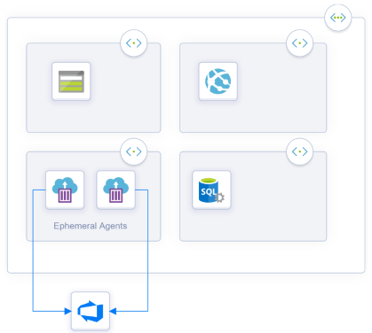
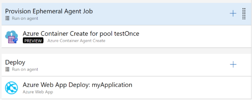

# Ephemeral Pipelines Agents

When you want to deploy to Azure Resources that aren't exposed on the internet, and only accessible via a [private network](https://docs.microsoft.com/en-us/azure/virtual-network/virtual-networks-overview) you are excluded from using [Microsoft-hosted agents](https://docs.microsoft.com/en-us/azure/devops/pipelines/agents/hosted?view=azure-devops), and you need to maintain your pool of [self-hosted agents](https://docs.microsoft.com/en-us/azure/devops/pipelines/agents/agents?view=azure-devops#install).

Ephemeral pipelines agent eliminates the need to maintain self-hosted agents (for **deployment** purposes) and still be capable of deploying to private azure resources. Ephemeral pipeline agents run in an Azure Container Instance (no public IP address and access to the private network) which are created on a needed basis to run a single a pipeline job.

This repo has several components that allow deployments to private virtual networks using short-lived agents and without having to maintain a permanent pool of self-hosted agents.

The purpose of this task is to create a short-lived Azure Pipelines Agent to run a deploy in a private virtual network so you can deploy assets to Azure Resources that are not internet accessible.

This way, you can deploy to private Azure resources without having to expose them on the internet or having to maintain self-hosted agents on the same (or with access) virtual network.

## How it works

This technique relies on three requirements

1. A docker image that can run an Azure Pipelines agent in a container
1. Provision, an ephemeral agent, to run a deployment job (once)
    * While this can be done manually with a task, we have created a task that provisions, configures and registers an agent on a [Azure Container Instance](https://azure.microsoft.com/services/container-instances/). The task works in symbiosis with the docker image.
1. The container runs a single pipeline job (and **only** one), unregisters the agent and deletes the container.
    * While an external component can do this, we have delegated the operation to the container. It can self destruct to eliminate moving parts and external components.

Your pipelines have to be structured the following way. It has (at least) two jobs:

* The first job uses this task and provisions and configures an ephemeral agent in a specific pool of your choice.
* The second job (runs **after** the first one has finished) does the actual deployment. It runs on the pool in which the first job registered the agent (after the job is executed the agent self destructs)

## Azure Pipelines Agent Docker Image

You can build your image to run the jobs (as long you follow the interface) or you can use the provided **basic** docker images.

If the provided images don't have the necessary software, you need to deploy; you can base your image on the provided basic image. By using the base image, you don't have to implement the logic that registers the agent and deletes the container. 

You need to build and publish it to a docker registry (either public or private).  The repo contains an [Azure Pipeline YAML](AgentImages/Azure-Pipelines.yml) file that builds and publishes the image to a registry.

Learn how to [build and publish the image(s)](AgentImages/Readme.md)

## Task

This repo contains a [task](Extension/AzureContainerCreate) packaged as an [Azure DevOps Extension](Extension) that provisions an Azure Container Instance (based on an image of your choice stored in any docker registry (anonymous or authenticated)).

You can opt to build the extension yourself (and publish on the marketplace as a private extension) or install the publicly available extension from the  [marketplace](https://marketplace.visualstudio.com/items?itemName=tiago-pascoal.EphemeralPipelinesAgents).

The task works in symbiosis with the agent docker image to make sure the agent is registered, only runs one job and the container is deleted after the job is finished.

Learn [how to use the extension](Extension/overview.md)

### Publishing the extension

The provided pipeline task is packaged as an Azure DevOps Extension. To publish the extension, you need to have a publisher and change the manifest to include your publisher id.

Read all the necessary steps in [Develop a web extension for Azure DevOps Services](https://docs.microsoft.com/en-us/azure/devops/extend/get-started/node?view=azure-devops)

## Requirements

You have to have a dedicated subnet in your virtual network just to run the ephemeral agents.

The agent must be running in the same Azure location as the virtual network.

The [Samples](Samples) folder has a [create-vnet.sh](Samples/create-vnet.sh) script that creates a virtual network and a bunch of subnets. It creates a resource group called `ephemeral-agents-sample` with a vnet that holds roughly 64K IP addresses and 5 subnets (arbitrary names and intention just for illustration purposes)

* Compute with ~2K IP addresses for compute resources
* Storage with ~2K IP addresses for storage resources
* data with ~2K IP addresses for data resources
* Bastion with 0.5K IP addresses to have VMs that act as bastions if needed
* Agents with 0.5K IP addresses for ephemeral agents (this is **essential** agents need to be on a dedicated subnet)

All the subnets share the same network security group.

## Recommendations

Use **one** agent pool per team project/virtual network

Provisioned agents should be placed in its resource group (one per agent pool).

### Sample pipeline

There are some [sample pipelines](https://github.com/microsoft/azure-pipelines-ephemeral-agents/Samples) that show how you can use it to deploy to a resource in a private vnet:

* [Samples/storage-pipeline/Azure-Pipelines.yml] Copy files to a [azure storage container](https://docs.microsoft.com/en-us/azure/storage/common/storage-introduction)

The pipeline assumes the existence of:

* A virtual network called `sampleprivatenetwork` in the `ephemeral-agents-sample-vnet` resource group (`create-vnet.sh` takes care of that for your)
* An azure storage account called `ephemeralsamplestorage` with a container called `test` (access restricted to the created private virtual network. You can use the provided `create--storage.sh`)
* An Azure Resource Manager service connection called `sample-azure-subscription` (with permissions to create and access the resource groups)
* An agent pool called `sample-ephemeralpool` (the pipeline uses `system.accesstoken` OAuth token, so build account requires enough permissions to register agents on the pool) [see more](AgentImages/Readme.md#OAuthtoken) (you can also opt to use a PAT token if you prefer)
* A docker container registry service connection called `ephemeralsampleregistry` (in this case it is assumed to be an Azure Container Registry but that is mainly an assumption based on the image fully qualified name). See [Create a service connection](https://docs.microsoft.com/en-us/azure/devops/pipelines/library/service-endpoints?view=azure-devops&tabs=yaml#create-a-service-connection) and [Docker Registry service connection](https://docs.microsoft.com/en-us/azure/devops/pipelines/library/service-endpoints?view=azure-devops&tabs=yaml#sep-docreg)

> You need an azure container registry (you can use for example the provided [create-acr.sh](Samples/create-acr.sh) script to create one) that holds the image to be used. The pipeline assumes an Azure Container Registry named `ephemeralsampleregistry`. Since a registry needs to be universally unique, it is most likely you have to change the name of the registry in both the script and the pipeline.

## Known issue(s)/Limitations

Azure Resource Manager Service service connections that use certificates are not supported.

Azure Container Instances with virtual networks are currently in preview, and they have some limitations.

See more at [Deploy container instances into an Azure virtual network preview limitations](https://docs.microsoft.com/en-us/azure/container-instances/container-instances-vnet#virtual-network-deployment-limitations)

## Contributing

This project welcomes contributions and suggestions.  Most contributions require you to agree to a
Contributor License Agreement (CLA) declaring that you have the right to, and actually do, grant us
the rights to use your contribution. For details, visit https://cla.opensource.microsoft.com.

When you submit a pull request, a CLA bot will automatically determine whether you need to provide
a CLA and decorate the PR appropriately (e.g., status check, comment). Simply follow the instructions
provided by the bot. You will only need to do this once across all repos using our CLA.

This project has adopted the [Microsoft Open Source Code of Conduct](https://opensource.microsoft.com/codeofconduct/).
For more information see the [Code of Conduct FAQ](https://opensource.microsoft.com/codeofconduct/faq/) or
contact [opencode@microsoft.com](mailto:opencode@microsoft.com) with any additional questions or comments.
